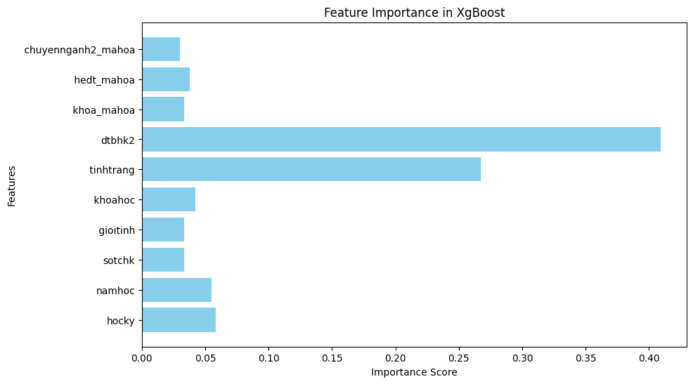

# **DỰ ĐOÁN ĐIỂM TRUNG BÌNH HỌC KỲ SINH VIÊN DỰA TRÊN DỮ LIỆU HỌC TẬP QUÁ KHỨ**
Đồ án này tập trung vào việc dự đoán điểm trung bình học kỳ của sinh viên dựa trên các yếu tố đầu vào như điểm trung bình học kỳ trước, chuyên ngành, và các thông tin khác. Mô hình chính được sử dụng là **XGBoost** – một thuật toán mạnh mẽ cho các bài toán dự đoán.

## **1. Tính năng chính**
- Tiền xử lý dữ liệu sinh viên (loại bỏ outlier, hợp nhất dữ liệu).
- Huấn luyện mô hình dự đoán DTBHK với XGBoost.
- Đánh giá hiệu năng mô hình thông qua các chỉ số MAE, MSE, RMSE, R².
- Dự đoán điểm trung bình học kỳ với dữ liệu mới.
- Triển khai ứng dụng dự đoán qua giao diện Streamlit.

## **2. Hướng dẫn cài đặt**
### **2.1. Yêu cầu hệ thống**
- Python >= 3.9
- Hệ điều hành: Windows 10 trở lên

### **2.2. Cài đặt thư viện**
1. Clone dự án:
   ```bash
   git clone https://github.com/CVK0406/IS353.P12_Nhom4.git
   cd IS353.P12_Nhom4
   ```
2. Tạo môi trường ảo:
   ```bash
   python -m venv .venv
   .venv\Scripts\activate         
   ```
3. Cài đặt thư viện:
   ```bash
   pip install -r requirements.txt
   ```

4. Cài đặt dự án thành gói Python (tuỳ chọn):
   ```bash
   pip install .
   ```

## **3. Cách sử dụng**
### **3.1. Xử lý dữ liệu**
- Xử lý dữ liệu từ 2 file 01.sinhvien.csv và sinhvien_dtb_hocky.csv:
   ```bash
   python src/xgboost-package/data_preprocessing.py
   ```
### **3.1. Huấn luyện và đánh giá mô hình**
- Chạy các bước huấn luyện và đánh giá từ dòng lệnh:
   ```bash
   python src/xgboost-package/train.py --input data/processed/final_data.csv --output_dir models/
   python src/xgboost-package/evaluate.py --model models/xgboost_model.pkl --input data/processed/final_data.csv
   ```

### **3.2. Huấn luyện và đánh giá mô hình qua giao diện Streamlit (Tùy chọn)**
- Chạy ứng dụng:
   ```bash
   streamlit run path_to_your_src_folder/xgboost-package/app.py
   ```
- Mở trình duyệt và truy cập: `http://localhost:8501`.

## **4. Cách kiểm thử**
- Chạy các test case bằng **pytest**:
   ```bash
   pytest tests/
   ```

## **5. Mô hình và dữ liệu**
### **5.1. Tiền xử lý dữ liệu**
- Loại bỏ các outlier dựa trên IQR.
- Hợp nhất dữ liệu từ nhiều nguồn (`sinhvien_dtb_hocky.csv`, `01.sinhvien.csv`).
- Tạo biến phụ thuộc (`dtbhk2`) để phục vụ cho dự đoán.

### **5.2. Mô hình dự đoán**
- Sử dụng thuật toán **XGBoost** với các tham số:
  - `n_estimators`: 100
  - `learning_rate`: 0.1
  - `max_depth`: 3
  - `random_state`: 42

## **6. Kết quả**
### **6.1. Đánh giá mô hình**
- **MAE (Mean Absolute Error)**: 0.8111915063141587
- **MSE (Mean Squared Error)**: 1.4284590392395404
- **RMSE (Root Mean Squared Error)**: 1.1951815925789437
- **R² Score**: 0.6155413815407418

### **6.2. Feature Importance**
Các đặc trưng quan trọng nhất trong mô hình:



## **7. Đóng góp**
Chúng tôi luôn hoan nghênh các đóng góp từ cộng đồng! Hãy tạo **Pull Request** hoặc báo lỗi tại [Issues](https://github.com/CVK0406/IS353.P12_Nhom4/issues).

## **8. Giấy phép**
Dự án này được cấp phép theo giấy phép [Apache-2.0 license](https://github.com/CVK0406/IS353.P12_Nhom4#Apache-2.0-1-ov-file).
